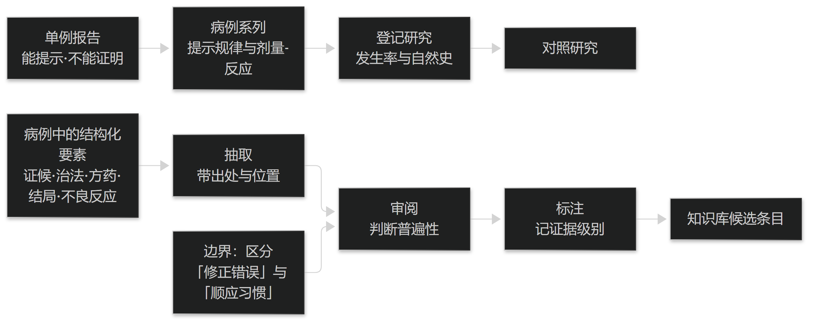

# 第28章 从病例报告到知识沉淀

## 28.1 证据强度与数据回流

### 28.1.1 单例报告、病例系列与登记的区别

单例报告的价值在于提示而非证明：它能报告"疾病或症状之间意外的关联""意外的病程事件""罕见表现"或"对现有认识的挑战"，但不能据此推断疗效或发生率。

病例系列是多例的汇总，能提示规律与剂量-反应线索，但仍缺少对照；登记研究（把连续病例按统一字段记录下来）则能支持发生率与自然史的描述，前提是纳入连续、字段统一。

因此三者对结论的支撑力依次递增，但都不等同于对照研究。写作与引用时必须如实标注类型——把单例当疗效证据，是病例报告最常见的误用。

> **要点**：单例报告能"提示"不能"证明"；系列>单例、登记>系列，但都不等于对照研究——引用时必须如实标注类型。

### 28.1.2 报告数据回流到病历与知识库

病例报告中的结构化要素（证候、治法、方药、结局、不良反应）是知识库的重要来源，但回流必须经过三道处理：抽取、审阅、标注来源。

抽取要记录出处与位置，便于回溯（见篇3 §6.2）；审阅要由专业人员判断该经验是否具备普遍性，避免把个案当成规则；标注则要让后续使用者知道这条知识的证据级别。

回流的边界同样重要：应当区分"修正既有知识中的错误"与"顺应某个医生的个人习惯"。前者是改进，后者会让知识库慢慢偏离规范（见篇7 §19.1）。**本节与篇7 的真实世界研究一节互为补充。**

> **要点**：病例回流要过三道——抽取（带出处）、审阅（判普遍性）、标注（记证据级别）；并区分"修正错误"与"顺应习惯"。

**表5-1 接口清单与落地要求**

| 接口对象 | 方向 | 关键内容 | 幂等 | 对账 | 失败兜底 |
| --- | --- | --- | --- | --- | --- |
| 患者主索引 | HIS → 病历 | 唯一标识、就诊号绑定 | 按索引键 | 每日人数与归并数 | 疑似重复人工确认，不静默新建 |
| 药品与耗材字典 | 以一方为准 → 双向映射 | 编码、规格、单位、炮制品 | 按映射键 | 映射覆盖率 | 未覆盖项禁止自动联动 |
| 检验结果 | LIS → 病历 | 项目、结果、单位、参考区间、时间 | 按报告号 | 报告条数与关键字段 | 待处理队列 + 可重放 |
| 处方与医嘱 | 病历 → HIS | 药品、剂量、单位、用法、疗程 | 按业务单号 | 条数与金额一致性 | 失败回执 + 人工核对 |
| 收费与结算 | HIS → 病历（回写） | 实收、退费、欠费状态 | 按结算单号 | 金额与条数 | 差异明细清单 |
| 医保合规 | HIS → 病历（回写） | 医保目录匹配结果、拒付原因 | 按申报号 | 申报与回执一致率 | 拒付原因回写并提示 |

表5-1　共 6 行 × 6 列 · 来源：本书定义（接口对象参照 OpenHIS 生态的对接范围）

<figure><figcaption>
从单例报告到知识沉淀的回流
</figcaption></figure>

## 28.2 中医病例报告的特有要求

### 28.2.1 四诊与辨证依据的报告

中医病例报告要额外写清两件事：征象是怎么取得的，以及辨证是凭什么下的。前者要求记录四诊信息的取得方式（问、望、闻、切，或设备采集）与时间；后者要求列出支持该证候的具体征象。

只写"舌淡苔白、脉沉细，辨为脾阳虚"是不够的——读者无法判断这两项征象与结论之间的推理是否成立，也无法在自己的患者身上复现这一判断。

因此规范的写法是把依据与结论并列呈现，并注明不确定之处（如"脉象受就诊时情绪影响，仅供参考"）。这与篇3 建立的"最小记录单元四要素"、篇5 的"推理链必须可输出"是同一套要求在不同场景的落地。

> **要点**：中医报告要写清"征象怎么取得"与"辨证凭什么下"；只给结论不给依据，读者无法复现判断。

### 28.2.2 方药剂量、疗程与随访

中医病例报告的可比性高度依赖三件事：剂量（数值与单位，如克、枚、片，不能写成"适量"）、疗程（总剂数、频次、每剂服法）、以及随访（时点与评价口径）。

加减必须写明理由：针对哪个兼夹、依据什么变化。否则读者无法判断这是"依证调整"还是"随意增删"——前者可学习，后者不可。

结局评价要区分"证候改善"与"患者自评改善"，并给出可操作的口径（如症状评分、复发次数）。把这两者混为一谈，会让报告失去可重复测量性。**本节要求与篇6 的方剂配伍、篇7 的评价指标相互衔接。**

> **要点**：中医报告可比性靠三件事——剂量（数值+单位）、疗程（剂数/频次/服法）、随访（时点+口径）；加减必须写理由。

**表5-2 上线切换检查表**

| 步骤 | 检查点 | 判据（可观测） | 回退方式 |
| --- | --- | --- | --- |
| 1 主数据 | 患者索引、科室、人员、药品字典 | 映射覆盖率 100%，抽样核对通过 | 冻结新映射，回到人工核对 |
| 2 病历书写 | 模板、要素字典、结构化输入 | 抽查 30 份病历要素填写率达标 | 切回原书写方式（并行期） |
| 3 医嘱与处方 | 开立 → 药房 / 收费联动 | 条数与金额对账差异为 0 | 关闭联动开关，改人工传递 |
| 4 收费与药房 | 发药、退费、库存变动 | 日报对账差异为 0 且明细为空 | 恢复原收费流程 |
| 5 医保与报表 | 目录匹配、申报、回执 | 申报一致率达标，差异原因可解释 | 退回上一阶段，暂停申报自动化 |

表5-2　共 5 行 × 4 列 · 来源：本书定义（步骤顺序据篇9 §26.2.2）
