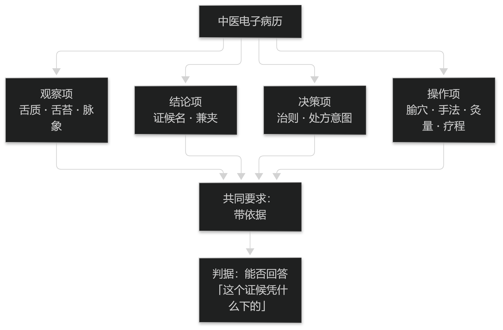

# 第1章 中医电子病历的定位与演进

## 1.1 概念与边界

### 1.1.1 何谓中医电子病历

中医电子病历是中医诊疗活动在信息系统中的完整记录，它以通用的电子病历为底座，额外承载四诊信息、辨证结论、治则治法、方药与医嘱等中医特有内容。

与通用电子病历相比，它的差异不在"电子"，而在"记录什么"：通用病历记录的是现代医学的观察与处置，中医电子病历还必须记录"依据哪些征象得出何种证候、据此立何法、用何方何穴"。

因此它天然是"论证型"的：每一条结论都应当能回溯到它所依据的征象，这也是本教材反复强调可追溯性的原因。

> **要点**：判断一份记录是否合格的唯一标准是——能否回答"这个结论凭什么下的"。答不上来，就不是电子病历，只是一个电子文件夹。

### 1.1.2 它不是什么：三条边界

第一条边界：它不是处方系统。开方只是链条的末端，前面的采集、判断、立法的缺失，用再好的处方库也补不回来。

第二条边界：它不是知识库。知识库回答"通常怎么办"，病历回答"这次为什么这么办"；两者必须分开建设，否则知识更新会污染历史记录。

第三条边界：它不是评价工具。病历服务于诊疗过程，疗效评价需要额外的设计与数据，不能把病历数据直接当成疗效证据。

> **要点**：把"处方系统""知识库""评价工具"三件事分清楚；混建的代价是知识更新污染历史记录，且无法审计。

**表1-1 三条边界：它不是什么**

| 对象 | 它回答 | 混建的代价 |
| --- | --- | --- |
| 处方系统 | 怎么开方 | 开方只是末端，前面的采集与判断缺失补不回来 |
| 知识库 | 通常怎么办 | 知识更新会污染历史记录 |
| 评价工具 | 这次办得对不对 | 疗效评价需额外设计，病历数据不能直接当证据 |

表1-1　共 3 行 × 3 列 · 来源：本书定义（篇1 §1.1.2）

## 1.2 与通用电子病历的关系

### 1.2.1 共用的底座

两者共用同一套底层能力：患者主索引、就诊与医嘱记录、时限与签名规则、权限与审计。这些能力属于通用医疗信息系统的成熟部分，中医电子病历不应重复造轮子。

共用底座带来的直接好处是合规成本被摊薄：病历的不可篡改、修改留痕、电子签名等要求，在底座层一次性满足，中医特有的数据结构叠加其上。

风险也随之而来：如果底座的数据模型不允许扩展字段，中医内容就会被塞进"备注"里，最终退化为不可计算的长文本。

> **要点**：共用底座的价值是合规成本被摊薄；风险是底座不允许扩展字段时，中医内容退化为不可计算的备注。

### 1.2.2 中医特有的增量

增量有四类：一是观察项，如舌质、舌苔、脉象的部位与性质；二是结论项，如证候名与兼夹；三是决策项，如治则与处方意图；四是操作项，如腧穴、手法、灸量与疗程。

这四类增量的共同特点是"带依据"——观察项要说明由谁在何时以何法取得，结论项要说明由哪些观察项支持。系统设计时必须为"依据"预留位置，而不是事后补。

判断一个中医电子病历系统是否成熟，可以只看一件事：能否回答"这个证候是凭什么下的"。

> **要点**：中医增量的四类（观察/结论/决策/操作）共同特点是"带依据"；系统必须在设计时为"依据"预留位置，不能事后补。

**表1-2 中医特有的四类增量**

| 类别 | 例子 | 共同要求 |
| --- | --- | --- |
| 观察项 | 舌质、舌苔、脉象部位与性质 | 注明由谁、何时、以何法取得 |
| 结论项 | 证候名与兼夹 | 注明由哪些观察项支持 |
| 决策项 | 治则与处方意图 | 可回溯到证候与依据 |
| 操作项 | 腧穴、手法、灸量、疗程 | 可量化、可复算 |

表1-2　共 4 行 × 3 列 · 来源：本书定义（篇1 §1.2.2）

<figure><figcaption>
中医电子病历的四类增量与「带依据」要求
</figcaption></figure>
