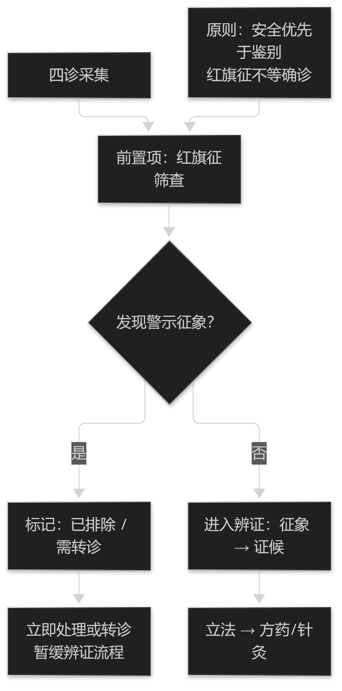

# 第5章 从临床决策到决策支持

## 5.1 认知偏倚与系统防线

### 5.1.1 偏倚为什么难以自纠

临床决策中会引入多种认知偏倚，医生须意识到它们并主动限制其影响（这一主题的经典论述见 Croskerry P. From mindless to mindful practice—cognitive bias and clinical decision making. N Engl J Med. 2013;368(26):2445-8）。

偏倚难以自纠的原因在于它不表现为"错误的感觉"：锚定于首诊印象、过早结束鉴别、只想起最近见过的病例，这些过程在主观上与"经验判断"难以区分。

所以单靠"提高警惕"并不够。可操作的防线是**外置的检查点**：把"是否考虑过其他诊断""是否有红旗征""是否存在可解释全部表现的单因"变成必须回答的条目，而不是可选的自觉。

> **要点**：认知偏倚主观上像"经验判断"，靠提高警惕不够；要靠外置检查点（考虑过其他诊断？有红旗征？单因能否解释全部？）。

**表9-1 病名与证候的分工**

| 维度 | 服务于 | 编码取向 |
| --- | --- | --- |
| 病名 | 分类与统计 | 按分类体系编码，跨机构可交换 |
| 证候 | 辨证与决策 | 按辨证体系编码，支持主证与兼夹 |
| 临床名 | 记录医生的真实表达 | 与标准名用映射关联，不替换原词 |

表9-1　共 3 行 × 3 列 · 来源：本书定义（篇3 §7.1.1）

### 5.1.2 决策支持能做什么、不能做什么

由此可以划清决策支持的边界：它擅长的是**补齐没有系统性考虑的可能性**——提醒应考虑的其他诊断、提示红旗征、呈现与当前判断不一致的线索；它不能做的是替代临床判断本身。

尤其是，系统无法判断"这个患者在具体情境下最要紧的是什么"，也无法承担取舍的责任（见篇7 §18.2 的责任边界）。

因此设计的落点是"让未考虑的可能性变得可见"，而不是"给出正确答案"。按此标准，一个只复述医生已想到的内容的系统，即便准确率很高，也没有提供决策支持。

> **要点**：系统该做的是"让未考虑的可能性可见"，不是给正确答案；只复述医生已想到内容的系统不构成决策支持。

## 5.2 中医决策的可计算化

### 5.2.1 四诊中的红旗征与急症识别

把上面的框架落到中医场景，第一件事是明确：**红旗征优先于辨证**。当出现意识改变、剧痛、大出血、呼吸困难、持续高热、脱水或生命体征不稳时，必须先识别并处理急症或转诊，辨证与调方在此刻都不是首要任务。

这一点对中医电子病历有直接的记录要求：四诊信息采集界面上，警示性征象的位置应当优先于一般的辨证要素，且必须有"已排除/需转诊"的标记位。

把红旗征做成**前置项**而不是事后备注，是本教材反复强调的"安全优先"在采集环节的落地（呼应篇4 §10.1.2 的一致性检查与篇5 §12.2.1 的风险优先规则）。

> **要点**：中医场景里红旗征优先于辨证；采集界面应把警示征象前置并留"已排除/需转诊"标记位。

**表9-2 中药与方剂编码必须建字段的三件事**

| 字段 | 为什么必须建 | 缺失后果 |
| --- | --- | --- |
| 炮制品 | 同一药材不同炮制是不同的用药单元 | 把临床差异抹平 |
| 剂量与单位 | 数值需单位与精度才能比较 | 克与钱混算，无法校验 |
| 来源与等级 | 道地、等级影响用药判断 | 无法解释用量差异 |

表9-2　共 3 行 × 3 列 · 来源：本书定义（篇3 §7.2.1）

<figure><figcaption>
红旗征先行：先排危重，再进入辨证
</figcaption></figure>

### 5.2.2 辨证决策的量化尝试与边界

辨证属分析式决策，但它的量化程度天然受限：证候的判定条件可以写成显式规则（见篇6 §13.1），症状的程度却常缺少统一刻度，脉象等征象还依赖取得方式与个体差异。

因此可量化的是**结构与关系**（哪些要素支持哪个证候、要素之间的逻辑关系、依据的出处），而不是"证候的强度值"。把不可量化的部分强行赋值，会制造出看起来精确、实则不可复现的结论（见篇5 §12.2 的不确定性表达）。

可行的路径是分层：能显式的写规则，不能显式的如实标注不确定，并保留人工判断的入口。这也是本教材对"中医决策可计算化"的基本立场。

> **要点**：可量化的是证候判定的结构与关系，不是"证候强度值"；强行赋值会制造精确而不可复现的结论。
