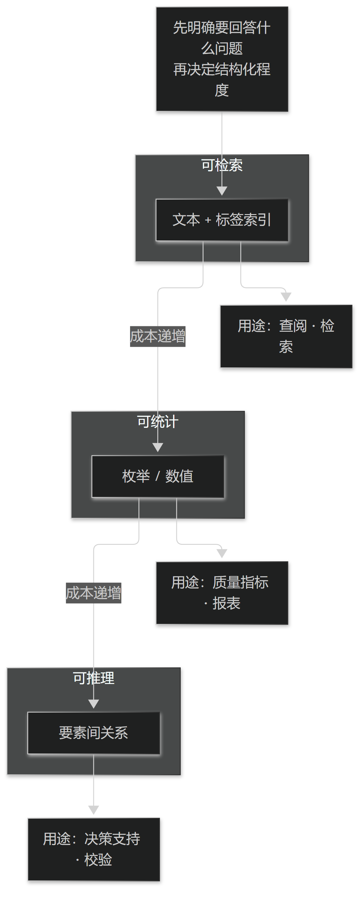

# 第8章 从自由文本到可计算结构

## 8.1 结构化程度

### 8.1.1 结构化的三个层次

第一层是"可检索"：内容以文本保存，但加了标签与索引，能按关键词找到。第二层是"可统计"：关键项落成枚举或数值，能计数与聚合。第三层是"可推理"：要素之间建立了明确关系，能被规则或模型使用。

三个层次对应不同的用途，也对应递增的成本。多数项目其实只需要第二层，却按第三层设计，结果医生负担过重、数据反而更差。

正确的做法是按用途定层次：先明确"要用这些数据回答什么问题"，再决定结构化到什么程度。

> **要点**：结构化三层（可检索／可统计／可推理）成本递增；先明确要回答什么问题，再决定结构化到什么程度。

<figure><figcaption>
结构化的三个层次与用途
</figcaption></figure>

### 8.1.2 何时不该结构化

以下情形不宜强行结构化：含义高度依赖语境的描述、需要整体理解才能判断的叙述、以及尚未形成学科共识的表述。

强行结构化的代价是"伪精确"：系统里出现了一个干净的值，但它与临床真实之间的偏差无人知晓，这比留一段诚实的长文本更危险。

判断标准是：结构化之后，医生是否仍然愿意用它来还原当时的判断。若不能，就应当保留文本并标注"未结构化"。

> **要点**：强行结构化的产物是"伪精确"——干净的值与临床真实的偏差无人知晓，比一段诚实的长文本更危险。

**表12-1 一致性检查的典型项**

| 检查项 | 矛盾示例 | 处理 |
| --- | --- | --- |
| 证—法一致 | 证属虚寒而立法清热 | 提示并要求修改或注明理由 |
| 法—方一致 | 立法补气而方以攻下为主 | 提示并要求修改或注明理由 |
| 禁忌冲突 | 妊娠而用妊娠禁忌药 | 强提示，安全优先 |
| 时间合理 | 处方时间早于接诊时间 | 阻断保存并提示核对 |

表12-1　共 4 行 × 3 列 · 来源：本书定义（篇4 §10.1.2）

## 8.2 后结构化

### 8.2.1 从既往病历抽取要素

后结构化是从已经写好的自由文本中抽取要素，用于统计、科研与决策支持。它的价值在于不动医生的工作习惯，代价是必须接受抽取误差。

抽取任务应分解为"识别 + 归一 + 定位"三步：先找到片段，再映射到标准词，最后记录它在原文中的位置以便回溯。

没有位置信息的抽取结果是不合格的：无法回溯就无法核对，无法核对的结果不能用于任何结论。

> **要点**：抽取结果必须带原文位置；无法回溯就无法核对，无法核对的结果不能用于任何结论。

### 8.2.2 抽取结果的校验与回填

抽取结果必须经过校验才能使用，校验方式包括抽样人工核对、与结构化字段交叉比对、以及内部一致性检查。

回填是指把抽取到的要素写回结构字段，这一步必须有医生确认或明确的标识，不能让机器结果冒充原始记录。

工程上应当把"原始文本""抽取结果""回填值"三者分开保存，并记录它们之间的推导关系，这样任何一条数据都能回答"它从哪来、经过谁的手"。

> **要点**：原始文本、抽取结果、回填值三者分开保存并记录推导关系；机器结果不得冒充原始记录。
