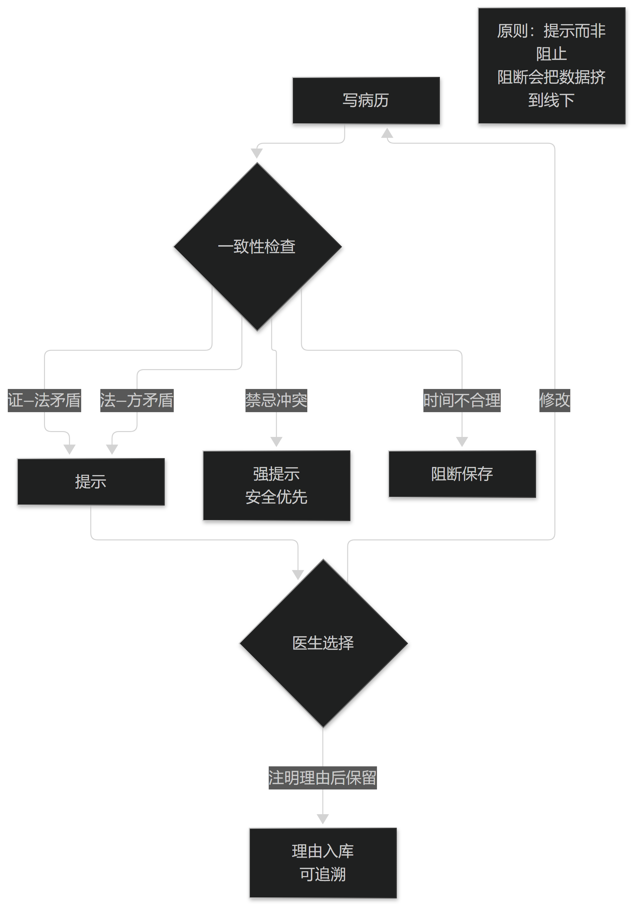

# 第8章 病历质量控制

## 8.1 完整性与一致性

### 8.1.1 完整性的定义与度量

完整性不等于"字段非空"，而是"回答某个问题所需的信息是否齐全"。因此完整性必须针对用途定义。

可度量的做法是按用途定义"必需要素集合"，然后统计实际填写率，并按科室、病种分层报告，避免用单一百分比掩盖结构性问题。

需要警惕"为了完整性而产生的垃圾数据"：强制必填会催生模板化填写，表面完整、实际失真。完整性与真实性必须同时看。

> **要点**：完整性要按用途定义；同时警惕"为了完整性而产生的垃圾数据"——强制必填会催生模板化失真。

### 8.1.2 一致性与内在矛盾检出

一致性检查的典型项包括：证候与治法是否相应、治法与方药是否相应、诊断与用药禁忌是否冲突、以及时间顺序是否合理。

这类检查大多可以用规则实现，不需要模型。它们的价值在于低成本地发现笔误与模板套用，这也是最容易产生信任感的功能。

设计原则是"提示而非阻止"：发现矛盾时提示医生，并要求其选择"修改"或"注明理由后保留"，理由本身也进入记录。

> **要点**：一致性校验的价值是低成本发现笔误与模板套用；原则是提示而非阻止，理由本身也要入库。

**表8-1 一致性检查的典型项**

| 检查项 | 矛盾示例 | 处理 |
| --- | --- | --- |
| 证—法一致 | 证属虚寒而立法清热 | 提示并要求修改或注明理由 |
| 法—方一致 | 立法补气而方以攻下为主 | 提示并要求修改或注明理由 |
| 禁忌冲突 | 妊娠而用妊娠禁忌药 | 强提示，安全优先 |
| 时间合理 | 处方时间早于接诊时间 | 阻断保存并提示核对 |

表8-1　共 4 行 × 3 列 · 来源：本书定义（篇3 §8.1.2）

<figure><figcaption>
一致性检查：提示而非阻止
</figcaption></figure>

## 8.2 时限、留痕与签名

### 8.2.1 时限规则

时限规则来自医疗文书管理要求，如首次病程记录的时限、抢救记录的补记时限等。系统应当把时限做成可配置的规则而不是写死在流程里。

对中医场景需要额外考虑"随证加减"的记录时点：一次查房中的加减应记录在当次记录中，而不是事后集中补写。

超时应有可追溯的标记与解释入口，而不是简单阻断医生保存——阻断的代价往往是把数据挤到线下。

> **要点**：时限做成可配置规则；阻断保存的代价往往是把数据挤到线下，比超时更糟。

### 8.2.2 修改留痕与电子签名

留痕的最小要求是记录修改人、时间、修改前后内容与修改理由，且原记录不可被物理删除。

电子签名需要满足身份认证、签名与文档绑定、以及不可否认性。中医病历中的处方与操作记录尤其需要签名即定稿。

一个常见误区是把"修改留痕"实现成日志文件了事。若界面看不到历次修改，可追溯性就只存在于数据库里，等于没有。

> **要点**：修改留痕若界面看不到，可追溯性就只存在于数据库里，等于没有。
