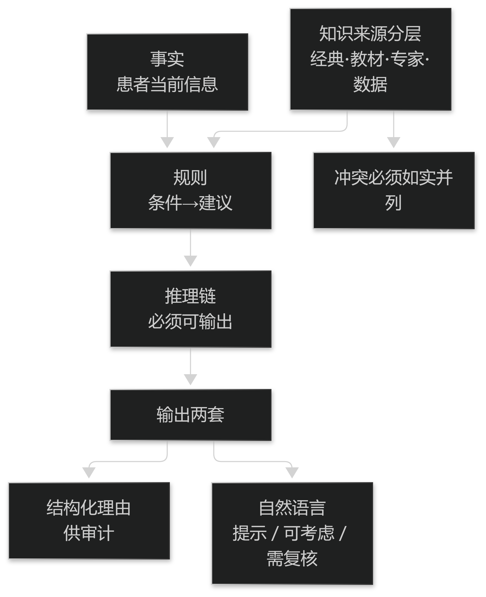

# 第10章 知识表示与规则引擎

## 10.1 知识库的结构

### 10.1.1 规则、事实与推理链

决策支持的最小结构是三件东西："事实"（患者当前信息）、"规则"（若满足条件则给出建议）、以及把二者连起来的"推理链"。

推理链必须可输出，否则医生无法判断建议是否适用于当前患者。可输出的推理链是中医决策支持能否被接受的关键。

规则的条件应尽量写成可核对的形式（要素名 + 取值 + 阈值），避免使用含糊的临床术语作为条件。

> **要点**：决策支持的最小结构＝事实＋规则＋可输出的推理链；推理链不可输出，医生就无法判断建议是否适用于本例。

<figure><figcaption>
决策支持的最小结构：事实＋规则＋推理链
</figcaption></figure>

### 10.1.2 知识的来源与版本

知识来源应当分层标注：经典条文、教材共识、专家经验、临床数据。不同来源的支持强度不同，必须分别展示。

知识库必须版本化：每次变更记录变更人、依据与影响范围。没有版本的知识库在出现问题时无法定位责任。

当知识之间存在冲突（不同来源给出相反建议）时，系统必须如实呈现冲突，而不是任选其一。

> **要点**：知识来源要分层标注（经典/教材/专家/数据）；冲突必须如实呈现，不许任选其一。

**表10-1 知识来源的分层与展示要求**

| 来源 | 支持强度 | 展示要求 |
| --- | --- | --- |
| 经典条文 | 强（在其体系内） | 给出篇名与条目位置 |
| 教材共识 | 较强 | 给出教材名与版本 |
| 专家经验 | 依专家与场景 | 标注为经验而非证据 |
| 临床数据推断 | 视设计与样本 | 标注为数据推断，不给绝对结论 |

表10-1　共 4 行 × 3 列 · 来源：本书定义（篇4 §10.1.2）

## 10.2 规则引擎

### 10.2.1 执行顺序与冲突消解

当多条规则同时被触发，需要确定优先级与消解策略。常见策略包括按特异性优先、按证据强度优先、以及按风险优先。

中医场景中"风险优先"通常最合适：涉及禁忌与安全性的规则应优先于一般性建议。

消解过程必须留痕：记录哪些规则被触发、哪些被抑制、为什么。否则建议的合理性无法复核。

> **要点**：多规则同时触发时"风险优先"——涉及禁忌与安全的规则优先于一般建议；消解过程必须留痕。

### 10.2.2 规则的可解释输出

输出应当是"结构化理由 + 自然语言表述"两套：前者供审计与计算，后者供医生快速阅读。

结构化理由至少包含：触发的事实、使用的规则与来源、以及可信度标记。

自然语言表述应避免绝对化措辞。建议类输出统一使用"提示/可考虑/需复核"这类分级用语。

> **要点**：输出两套——结构化理由（供审计）＋自然语言（供阅读）；措辞统一用"提示／可考虑／需复核"。
