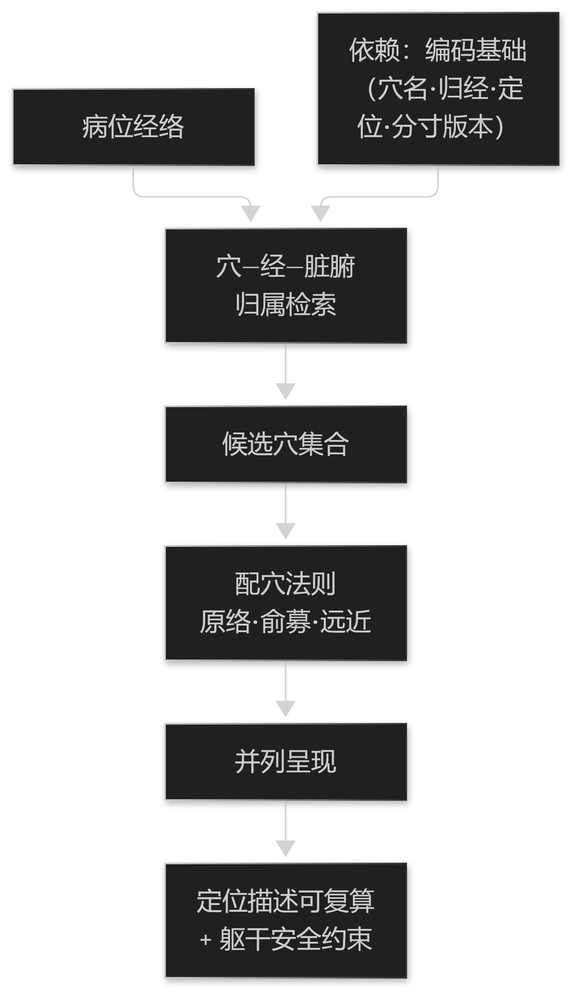

# 第17章 针灸推拿的决策支持

## 17.1 选穴与配穴

### 17.1.1 循经选穴

循经选穴要求系统掌握穴—经—脏腑的归属关系，并能按病位经络给出候选穴。这依赖第 5 章建立的编码基础。

候选穴应附带定位描述与取穴要点，且定位描述应可复算，以便不同操作者得到一致的取穴结果。

对特殊人群与部位（如胸背部、孕妇）应附加安全提示。

> **要点**：循经选穴依赖穴—经—脏腑归属；定位描述必须可复算，并对特殊人群与部位加安全提示。

<figure><figcaption>
循经选穴的候选生成与安全约束
</figcaption></figure>

### 17.1.2 配穴法则

传统配穴法则（如原络配穴、俞募配穴、远近配穴）应以显式规则形式实现，并注明出处。

配穴建议应说明所选法则与其适用证候，便于医生判断是否契合本次病例。

当多条法则给出不同结果时，应并列呈现而不是强行合并。

> **要点**：配穴法则以显式规则实现并注明出处；多法则结果不同时应并列而非强行合并。

**表21-1 三类临床指标**

| 类别 | 衡量 | 示例 |
| --- | --- | --- |
| 过程指标 | 有没有按规范做 | 四诊要素填写率、安全校验执行率 |
| 结局指标 | 患者是否改善 | 症状改善、生活质量、复发率 |
| 安全指标 | 有没有伤害 | 不良事件、漏诊、禁忌触犯 |

表21-1　共 3 行 × 3 列 · 来源：本书定义（篇7 §19.1.2）

## 17.2 刺灸法与疗程

### 17.2.1 刺灸法度

刺灸法度包括针刺深浅、方向、角度、留针时间、灸量与灸法。这些是可量化的操作参数，尤其应当结构化。

法度建议必须与部位安全约束联动：危险部位的深刺建议应被严格限制并给出警示。

对灸量应区分壮数与时间两种计量方式，避免混用造成误解。

> **要点**：刺灸法度是可量化参数，尤应结构化；必须与部位安全约束联动；灸量区分壮数与时间。

### 17.2.2 疗程与效应追踪

疗程设计应包含总次数、频次与评估间隔，并记录每次的实际执行情况。

效应追踪应记录每次治疗后的即时反应与阶段性变化，这些数据是后续方案调整的依据。

对无进展的情形，系统应提示重新审视诊断与治法，而不是机械延续原方案。

> **要点**：疗程含次数／频次／评估间隔并记录执行情况；无进展时应提示重审诊断与治法，而非机械延续。
