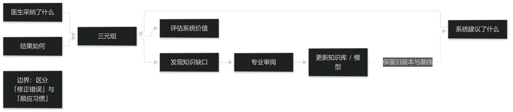

# 第19章 真实世界研究与数据回流

## 19.1 数据回流与学习闭环

### 19.1.1 回流什么最有价值

最有价值的回流数据是"系统建议了什么、医生采纳了什么、结果如何"这三元组。它既能评估系统，也能发现知识缺口。

单纯回流病历数据价值有限，因为它缺少"系统当时说了什么"这一对照项。回流设计必须在系统上线时就做，事后无法补齐。

回流数据的用途应当事先声明，避免"先收集再想用途"，那在合规上是高风险做法。

> **要点**：最有价值的回流是"建议了什么／采纳了什么／结果如何"三元组；回流设计必须上线时做，事后补不齐。

<figure><figcaption>
建议—采纳—结果：三元组回流
</figcaption></figure>

### 19.1.2 学习闭环的边界

从回流数据更新知识库与模型，必须区分"修正错误"与"顺应习惯"。前者是改进，后者可能导致系统学习到不规范的做法。

任何基于数据的学习更新都应经过专业审阅，并保留更新前的版本与评估结果。

闭环的节奏不宜过快：过于频繁的更新会让使用者无法建立稳定预期，也会让效果评估失去基线。

> **要点**：更新知识要区分"修正错误"与"顺应习惯"；任何学习更新都需专业审阅并保留旧版本与评估基线。

## 19.2 偏倚与漂移监测

### 19.2.1 数据漂移

数据漂移指输入分布随时间变化，如病种构成变化、术语使用习惯变化、或新设备引入。它会静默降低系统表现。

监测手段包括定期比较关键字段的取值分布与缺失率，并设置阈值告警。

漂移未必是坏事（可能反映真实疾病谱变化），关键是发现它并解释它。

> **要点**：数据漂移会静默降低表现；定期比较关键字段分布与缺失率并设阈值告警；漂移未必是坏事，要发现并解释。

### 19.2.2 模型与知识漂移

知识与模型也会漂移：标准修订后编码失效、新的专家共识取代旧规则、模型在旧数据上过时。

应建立"知识有效期"制度：每条规则标注生效日期与复核周期，到期自动进入待复核队列。

没有复核机制的知识库会随时间腐化，而这种腐化通常不会以报错的形式出现——它只是慢慢变得不对。

> **要点**：设"知识有效期"制度（生效日期＋复核周期）；腐化不以报错形式出现，它只是慢慢变得不对。
