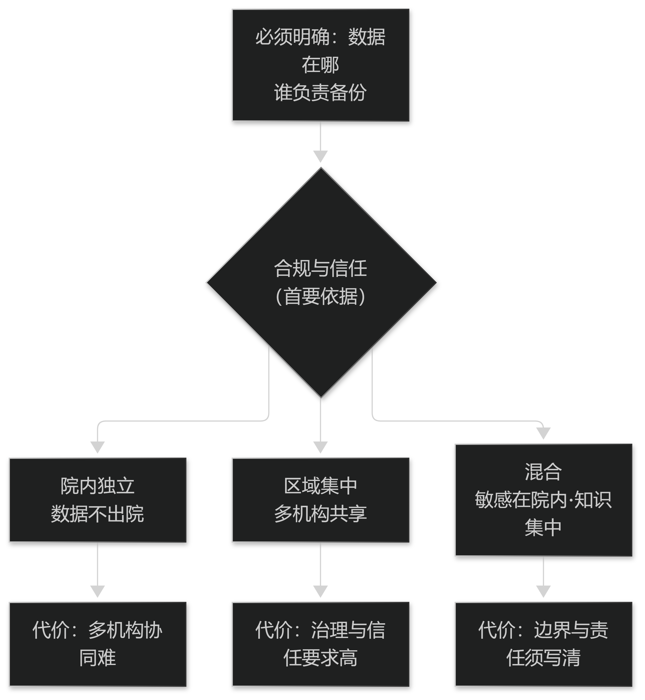

# 第20章 系统架构与集成

## 20.1 接口与集成

### 20.1.1 与HIS/EMR的接口

与既有系统的接口应遵循"只读优先、写入受限"的原则：优先从 HIS/EMR 取数，只有在必要时才回写。

回写的内容应尽量收敛到少量明确字段，并明确写入方与失败重试策略，避免在对方的库里留下不一致的中间状态。

接口设计必须包含幂等与对账机制：重复推送不应产生重复记录，每日应能核对两侧记录数。

> **要点**：接口"只读优先、写入受限"；回写字段要收敛并含幂等与对账，避免在对方库里留中间状态。

### 20.1.2 术语服务与主数据

术语服务是中医电子病历的枢纽：它负责名称归一、编码映射与版本管理，供所有模块调用。

主数据（药品、腧穴、检验项目等）应集中维护，避免各科室各建一套导致无法聚合。

术语服务必须带版本与生效时间，任何调用方都应能回答"这个映射什么时候生效的"。

> **要点**：术语服务是枢纽（归一／映射／版本），主数据集中维护；任何调用都要能回答"这个映射何时生效"。

## 20.2 部署形态与性能

### 20.2.1 部署形态

常见形态有三类：院内独立部署（数据不出院）、区域集中部署（多机构共享）、以及混合部署（敏感数据留在院内，模型与知识集中）。

形态选择的首要依据是合规与信任，而不是技术便利；中医病历数据的敏感性不容低估。

无论何种形态，都必须明确数据的物理位置与备份责任方。

> **要点**：部署形态首先由合规与信任决定（数据在哪、谁负责备份），而不是由技术便利决定。

**表20-1 三种部署形态的比较**

| 形态 | 数据位置 | 适用与代价 |
| --- | --- | --- |
| 院内独立 | 数据不出院 | 合规成本低；多机构协同难 |
| 区域集中 | 多机构共享 | 协同强；信任与治理要求高 |
| 混合 | 敏感数据在院内，模型与知识集中 | 折中；边界与责任须写清 |

表20-1　共 3 行 × 3 列 · 来源：本书定义（篇7 §20.2.1）

<figure><figcaption>
部署形态：合规与信任优先
</figcaption></figure>

### 20.2.2 性能与可用性

决策支持的响应时间直接影响采纳率：开方时的建议若超过一两秒，医生就会跳过。因此关键路径的性能是功能的一部分。

可用性设计要留有降级路径：当知识服务不可用时，病历书写必须不受影响，只是失去建议。

性能指标应当按场景设定（门诊并发、查房批量），而不是一个笼统的平均值。

> **要点**：响应时间是功能的一部分（超过一两秒医生就跳过）；必须有降级路径——知识服务挂了，病历书写不受影响。
