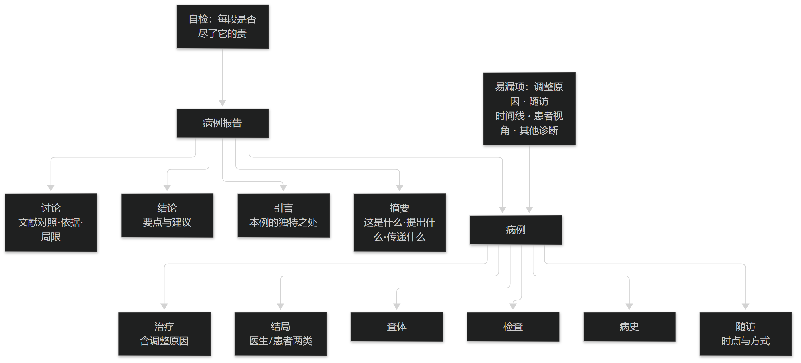

# 第23章 临床病例报告的撰写规范

## 23.1 报告的结构要素

### 23.1.1 四段式骨架与各段职责

临床病例报告是对单个患者的症状、体征、诊断、治疗与随访的详细报告。它通常包含四个部分：摘要、引言、病例与讨论，部分期刊另要求文末的结论或小结。

四段各有明确职责：摘要须说明"这个病例是什么、它提出了什么问题、它传递了什么信息"，篇幅宜短（一般不超过 150 词）；引言说明本例的独特之处以及它补充了什么；病例部分按时间顺序交代诊疗全过程；讨论把本例与已有文献对照，说明推断的依据与局限。

把职责写清楚的最大好处是"能自检"：每一段是否尽了它的责，是可以逐条核对的，而不是凭感觉判断写得够不够好。**本节的骨架依据《Guidelines To Writing A Clinical Case Report》（Heart Views 2017;18(3):104-105；PMID 29184619）。**

> **要点**：四段式（摘要/引言/病例/讨论）各有职责，责任写清才可自检；摘要宜短（指南建议一般不超过 150 词）。

**表23-1 病例报告四段式骨架与各段职责**

| 部分 | 必须回答 | 常见缺陷 |
| --- | --- | --- |
| 摘要 | 这个病例是什么、提出什么问题、传递什么信息 | 写成引言式铺垫，不给结论要点 |
| 引言 | 本例的独特之处、补充了什么 | 泛泛介绍疾病，不说为何值得报告 |
| 病例 | 病史 / 查体 / 检查 / 治疗（含调整原因）/ 结局 / 随访 | 漏写方案调整的原因与随访 |
| 讨论 | 与已有文献对照、推断依据与局限 | 只重复病例，不做讨论 |
| 结论 | 要点与对临床、教学、研究的建议 | 与摘要重复、无可操作建议 |

表23-1　共 5 行 × 3 列 · 来源：Guidelines To Writing A Clinical Case Report（Heart Views 2017;18(3):104-105 · PMID 29184619）

### 23.1.2 病例部分必须写清的六件事

病例部分是报告的主体，至少要写清六件事：病史（含既往史、家族史与相关社会心理因素）、查体所见、检查结果、治疗经过（含方案调整及其原因）、结局、随访。

其中"方案调整及其原因"最容易被写漏：读者真正关心的是"为什么改"，而不是"改成了什么"。同样，"结局"必须区分医生评估与患者自评两类结果，二者的差异本身就有信息量。

随访要给出时间点与随访方式。没有随访信息的病例报告，其价值会大幅下降——因为无法判断疗效是否持续、是否出现迟发问题。

> **要点**：病例部分必须写清六件事——病史、查体、检查、治疗（含调整原因）、结局、随访；缺"调整原因"与"随访"最致命。

<figure><figcaption>
病例报告的要素链与自检点
</figcaption></figure>

## 23.2 规范清单与知情同意

### 23.2.1 清单式自检（CARE 式条目）

成熟的报告规范通常以清单形式给出，用于交付前逐项自检。2013 年发布的 CARE 清单包含：标题、关键词、摘要、引言、患者信息、临床所见、时间线、诊断评估、治疗干预、随访与结局、讨论、患者视角、知情同意。

清单的正确用法不是"打勾交差"，而是"每一项都要能指到文中的具体位置"。指不到位置的项，等于没写。

对中医病例报告而言，清单还提示了几处容易忽略的项：时间线（把病程做成时间轴，而不是散落在段落里）、患者视角（患者自己对疗效的感受）、以及"诊断评估"中"考虑过的其他诊断"。**本节清单条目据 CARE Case Report Guidelines（2013）整理。**

> **要点**：清单的正确用法是"每一项都能指到文中位置"；指不到位置的项等于没写。中医报告尤易漏时间线、患者视角、其他诊断。

**表23-2 CARE 清单（2013）条目与自检要求**

| 序号 | 条目 | 自检要求 |
| --- | --- | --- |
| 1 | 标题 | 诊断或干预＋ case report 字样 |
| 2 | 关键词 | 2–5 个，含 case report |
| 3 | 摘要 | 结构化或非结构化；含独特性 / 主要症状与所见 / 诊断·干预·结局 / 结论 |
| 4 | 引言 | 简述本例为何独特，可引文献 |
| 5 | 患者信息 | 去标识化信息、主诉、既往与家族及社会心理史、既往干预及结果 |
| 6 | 临床所见 | 重要的查体与临床所见 |
| 7 | 时间线 | 把本次诊疗信息做成时间轴（图或表） |
| 8 | 诊断评估 | 方法与挑战、诊断（含考虑过的其他诊断）、预后特征 |
| 9 | 治疗干预 | 类型、给药方式（剂量 / 强度 / 疗程）、变更及原因 |
| 10 | 随访与结局 | 医生与患者评估的结局、随访检查、依从性、不良与意外事件 |
| 11 | 讨论 | 优势与局限、相关文献、结论依据、一段式要点 |
| 12 | 患者视角 | 患者对所受治疗的看法 |
| 13 | 知情同意 | 取得知情同意（按要求提供） |

表23-2　共 13 行 × 3 列 · 来源：CARE Case Report Guidelines（2013）· care-statement.org/checklist

### 23.2.2 知情同意与去标识化

发表病例报告需要患者的知情同意，多数期刊在投稿时要求提供；患者为未成年人时，需监护人同意。同意应当在动笔写作之前取得，而不是录用后再补。

去标识化要注意其局限：中医病例中的症状组合、方药组合在小样本下具有很强的可识别性，"去掉姓名"并不等于匿名（见篇3 §9.1）。

因此对外使用的病例材料应做两层处理：直接标识符删除或泛化，准标识符（年龄、地区、就诊时间）按需泛化；同时保留"这份材料的用途与授权范围"的记录，以便日后追溯。

> **要点**：知情同意须在动笔前取得（未成年人由监护人）；去标识化不等于匿名，需按用途与授权范围登记。
