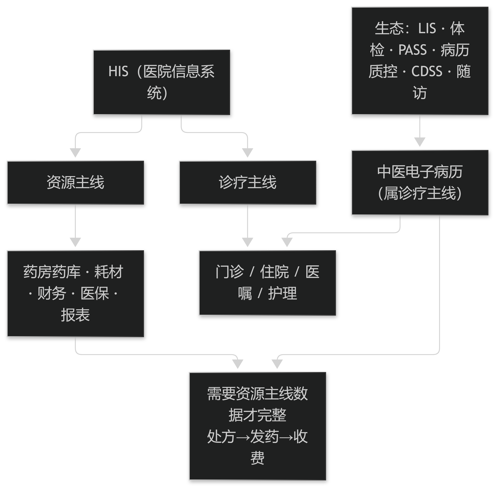

# 第25章 HIS 的功能构成与中医电子病历的位置

## 25.1 HIS 的核心模块与数据归属

### 25.1.1 十大核心模块与两条主线

医院信息系统（HIS）为医院提供从挂号到结算的全程业务支撑。以开源方案 OpenHIS 信创版为例，其集成十大核心模块：目录管理、基础数据配置、个性化设置、门诊与住院全流程管理、药房药库智能管控、精细化耗材管理、财务核算体系、医保合规对接及多维报表分析，共 372 项标准化功能。

这些模块可以归到两条主线上：**诊疗主线**（门诊、住院、医嘱、护理）与**资源主线**（药房药库、耗材、财务、医保、报表）。中医电子病历属于诊疗主线，但它需要资源主线的数据才能完整（例如处方要落到药房发药与收费）。

理解"两条主线"的价值在于明确**数据归属**：病历记录的是"为什么这么治"，收费与库存记录的是"实际执行了什么"。两者必须能对上账，又不应混为一谈（见篇3 §4.2 与篇8 §20.1）。**本节产品事实据 OpenHIS 开源医疗官网（open.tntlinking.com/open/medical，抓取日 2026-10-07）。**

> **要点**：HIS 模块分"诊疗主线"与"资源主线"；病历属诊疗，但需资源线数据才完整——两者要对上账，但不能混为一谈。

**表6-1 两种决策方式与切换触发**

| 决策方式 | 适用情形 | 主要风险 | 切换触发 |
| --- | --- | --- | --- |
| 模式识别（反射式） | 常见、典型、无线索提示其他可能 | 其他诊断与治疗可能性未被系统考虑 | 出现与该模式不相称的单项异常 |
| 分析式（结构化·量化） | 复杂病例、不典型表现、多病共存 | 耗时与成本上升，可能过度检查 | 不确定性已降到可处理、可行动 |
| 混合（推荐） | 大多数真实场景 | 需要明确"何时以何为主" | 模式识别提出假设，分析式验证 |

表6-1　共 3 行 × 4 列 · 来源：Merck Manual Professional Edition · Introduction to Clinical Decision Making（Full Review 2026-04）

<figure><figcaption>
HIS 两条主线与中医电子病历的位置
</figcaption></figure>

### 25.1.2 不同规模机构的取舍差异

同一系列产品会按机构规模分档，其模块差异直接决定集成方式。OpenHIS 的分档可作参考：**信创版**面向民营及公立一二级医院，十大核心模块，支持单体医院、集团化运营与区域医疗协同等多种部署；**通用版**面向公立二级以下医院、乡镇卫生院与社区卫生服务中心，含体检、后台管理、收费结算、医护协同、药房、电子病历等 10 大功能模块；**诊所系统**面向社区卫生服务站、村卫生室与民营诊所，仅 5 个核心模块（预约登记、就诊、收费发药、报表查询、库存管理）。

对集成设计的直接含义是：**不能假设对方系统具备同样的能力**。诊所系统可能没有独立的病历模块，也可能没有标准接口；同一套接口方案必须能降级运行，并在文档中写明各档位的能力边界。

这也是"接口契约"要写成能力清单、而不是写成一份固定报文的原因。**产品分档据 OpenHIS 官网。**

> **要点**：产品按机构规模分档（信创版/通用版/诊所系统），能力不等；接口必须能降级，契约写成能力清单而非固定报文。

## 25.2 中医电子病历在 HIS 生态中的位置

### 25.2.1 与检验、体检、用药监测等系统的关系

HIS 之外通常还并行若干专科系统，它们与病历之间存在明确的数据流向。OpenHIS 生态中可见的典型成员包括：**OpenLIS 实验室系统**（样本全流程闭环，覆盖登记、检验录入、结果审核、报告打印，强调遵循 ISO 15189 并支持与 HIS 无缝对接）、**OpenPEIS 体检系统**（体检预约、登记、检查、报告、结算，并能通过与其他系统的接口自动导入检验结果）、以及合理用药监测、病历质控、无纸化病案、临床辅助诊断（CDSS）与院后随访等。

对中医电子病历的接入要求由此确定：检验结果应"引进来"而不是让医生手抄；用药安全提示应在开方环节出现，而不是事后检查；病案与质控则要求病历本身可结构化导出（见篇5 §10.2 的规则触发时机）。

每接一个系统，都要回答三个问题：数据方向、触发时机、以及失败时谁兜底。**生态成员据 OpenHIS 官网。**

> **要点**：接每个外部系统都要回答三问——数据方向、触发时机、失败谁兜底；检验结果要"引进"而非手抄。

**表6-2 评估患者时必须回答的问题**

| 序号 | 必答问题 | 若答案为"是"的动作 |
| --- | --- | --- |
| 1 | 病史与查体是否提示某些特定诊断？ | 列出待验证的诊断假设并安排验证路径 |
| 2 | 是否存在红旗征（需先于确诊处理的紧急医学或社会问题）？ | 立即处理或转诊，暂缓鉴别流程 |
| 3 | 三方压力（不确定性 / 风险 / 成本）如何取舍？ | 显式记录取舍理由，便于复核 |

表6-2　共 3 行 × 3 列 · 来源：Merck Manual Professional Edition · Introduction to Clinical Decision Making（Full Review 2026-04）

### 25.2.2 "支持第三方电子病历"意味着什么

通用版明确标注"**支持第三方电子病历**"，这句话在集成层面有具体含义：HIS 不提供病历书写，而是把病历系统作为外部组件接入，并开放必要的对接点。

由此会产生三个必须事先谈定的问题：**主数据以谁为准**（患者索引、科室、人员、药品字典）、**病历在 HIS 内的"存在形式"**（只存指针还是存副本）、以及**医生操作路径**（医生从 HIS 登录后如何无感进入病历）。

其中"主数据以谁为准"最容易被忽略却代价最高：若两边各自维护药品字典，剂量单位与规格的差异会直接导致收费或校验错误（见篇3 §5.2 的剂量与单位要求）。**对接模式描述据 OpenHIS 官网通用版说明。**

> **要点**："支持第三方病历"要先谈定：主数据以谁为准、病历在 HIS 中是存指针还是副本、医生操作路径如何无感衔接。
