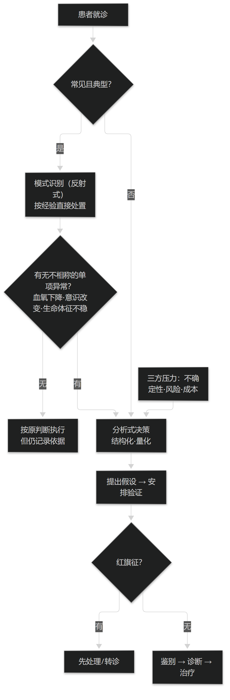

# 第25章 临床决策的两种基本方式

## 25.1 反射式的模式识别

### 25.1.1 何时够用：常见而典型的情形

在常见、直截了当的情形下，医生往往"反射式"地作出决策：先识别出疾病模式，再依据自身知识与经验（并结合患者的医学与社会背景）直接进行检查与治疗，而不逐项推演。

例如流感流行期间，一名平素健康的成人出现发热、严重肌痛、眶后疼痛与剧烈咳嗽已两天，很可能被识别为又一例流感，只需给予对症处理。这种模式识别效率极高，是日常临床的主力。

但"够用"的条件是明确的：病情常见、表现典型、且没有提示其他可能性的线索。离开这三个条件，模式识别就从优势变成了风险源。**本节与下一节的依据见 Merck Manual Professional Edition（Clinical Decision Making / Introduction，Full Review 2026-04）。**

> **要点**：模式识别是日常主力，但"够用"有前提——病情常见、表现典型、且无线索提示其他可能。

**表25-1 两种决策方式与切换触发**

| 决策方式 | 适用情形 | 主要风险 | 切换触发 |
| --- | --- | --- | --- |
| 模式识别（反射式） | 常见、典型、无线索提示其他可能 | 其他诊断与治疗可能性未被系统考虑 | 出现与该模式不相称的单项异常 |
| 分析式（结构化·量化） | 复杂病例、不典型表现、多病共存 | 耗时与成本上升，可能过度检查 | 不确定性已降到可处理、可行动 |
| 混合（推荐） | 大多数真实场景 | 需要明确"何时以何为主" | 模式识别提出假设，分析式验证 |

表25-1　共 3 行 × 4 列 · 来源：Merck Manual Professional Edition · Introduction to Clinical Decision Making（Full Review 2026-04）

### 25.1.2 何时会出错：同一模式的不同病因

模式识别的代价是：**其他诊断与治疗可能性没有被认真、系统地考虑**。仍以流感样表现为例，若该患者血氧饱和度下降，那么真正的病因可能是 COVID-19，或细菌性肺炎而需要用抗生素——按流感处理就会延误。

这类错误有一个共同结构：**表象相同而实质不同**。判断的风险不在于"识别错了模式"，而在于**没有为"同一模式的多种病因"留出检查的出口**。

因此一条可操作的纪律是：当出现与该模式不相称的**单项异常**（如血氧下降、意识改变、生命体征不稳）时，必须从模式识别切换到分析式决策。这条纪律可以直接写进决策支持的触发条件。

> **要点**：模式识别的风险不在"识别错"，而在"没为同一模式的多种病因留出口"；出现与该模式不相称的单项异常即须切换到分析式。

<figure><figcaption>
两种决策方式的分岔与切换触发
</figcaption></figure>

## 25.2 结构化的分析式决策

### 25.2.1 评估患者时必须回答的问题

在复杂病例中，结构化、量化、分析式的方法更合适；即使模式识别已给出一个很可能的方向，分析式决策依然常常必要。

评估患者时，医生通常必须回答两类问题：其一，**病史与查体是否提示某些特定诊断**；其二，**是否存在"红旗征"**——提示需要先于确诊就处理的紧急医学或社会问题。

注意这两问的**顺序含义**：红旗征是"先处理"的问题，它不等确诊。把这条写进系统，就是"安全优先于鉴别"的规则化表达（呼应篇4 §10.2 的冲突消解）。

> **要点**：评估患者必答两问——病史查体提示哪些诊断？有无红旗征需先于确诊处理？红旗征"先处理"，不等确诊。

**表25-2 评估患者时必须回答的问题**

| 序号 | 必答问题 | 若答案为"是"的动作 |
| --- | --- | --- |
| 1 | 病史与查体是否提示某些特定诊断？ | 列出待验证的诊断假设并安排验证路径 |
| 2 | 是否存在红旗征（需先于确诊处理的紧急医学或社会问题）？ | 立即处理或转诊，暂缓鉴别流程 |
| 3 | 三方压力（不确定性 / 风险 / 成本）如何取舍？ | 显式记录取舍理由，便于复核 |

表25-2　共 3 行 × 3 列 · 来源：Merck Manual Professional Edition · Introduction to Clinical Decision Making（Full Review 2026-04）

### 25.2.2 三方压力下的取舍

临床决策始终在三种相互冲突的压力下进行：**降低诊断的不确定性、降低对患者的风险、控制成本**。三者不可能同时最优，任何决策都是在它们之间取舍的结果。

因此"决定收集哪些信息、开哪些检查、如何治疗"本身就是决策的内容，而不是决策之前的准备。把信息采集当作"免费的准备动作"，是很多流程设计失误的根源。

对决策支持的含义是：系统不能只优化其中一项（例如只追求"不漏诊"而无限增加检查），而应当把三者显式摆出来，让取舍可见、可复核。**本节依据同上（Merck Manual, Clinical Decision Making）。**

> **要点**：决策始终在"降不确定性 / 降风险 / 控成本"三方压力下取舍；信息采集本身就是决策内容，不是免费准备。
