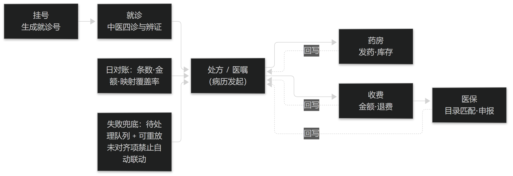

# 第26章 接口落地与运行保障

## 26.1 接口的落地要点

### 26.1.1 患者主索引与就诊号对齐

接口落地的第一件事是**身份对齐**：以患者主索引（EMPI 式的唯一标识）为准，把挂号产生的就诊号与病历记录绑定。

常见的失败模式是"一人多号"：同一患者因姓名同音、证件号录入差异或异地就诊而产生多个索引，导致既往病历与本次就诊割裂——对中医而言，这直接切断了"既往史与体质背景"的可用性。

因此接口要包含**索引归并与冲突告警**：发现疑似重复时提示人工确认，而不是静默新建。这条要求应写进接口契约的验收项。

> **要点**：接口第一件事是身份对齐（主索引+就诊号）；要能归并重复索引并告警，否则既往史与体质背景会被割裂。

### 26.1.2 医嘱、处方与收费的联动

病历中开出的处方与医嘱，必须能够驱动下游的药房、收费与医保环节；反之，下游的执行结果也应回写（见篇3 §2.2.1 的数据链）。

联动设计有两条纪律：**其一，只有一次"权威写入"**（谁是这个数据的产生者就由谁写，其他系统只引用），避免双写造成不一致；**其二，单位与编码在对齐前不联动的开关必须可关**——当药品字典或医保目录尚未对齐时，宁可降级为"人工核对"，也不要让错误数据流入收费。

对中医场景还有一条特殊要求：**中药饮片的剂量单位与炮制品**必须能完整传递到药房与收费，否则会出现"病历写克、收费按包"的错配（见篇3 §5.2）。

> **要点**：联动纪律——只有一次"权威写入"；字典/医保目录未对齐时，宁降级为人工核对，也不让错数据进收费。

<figure><figcaption>
接口联动与对账闭环（门诊为例）
</figcaption></figure>

## 26.2 运行保障

### 26.2.1 幂等、对账与差错处理

接口上线后最常见的故障不是"接口不通"，而是**重复与错位**：同一条医嘱被推送两次、某个批次丢失、上下游数据对不上。

因此三项机制缺一不可：**幂等**（同一业务单号重复投递只生效一次）、**对账**（按日核对条数与关键字段，差异要能列出明细）、**差错处理**（失败消息进入待处理队列并可重放，而不是静默丢弃）。

对账指标应当可观测并纳入值班巡检；把"接口成功率"作为唯一指标是不够的，它无法发现"推成功了但内容不对"这类问题（见篇8 §20.2 的降级路径）。

> **要点**：接口故障多是"重复与错位"；幂等、对账、差错重放三项缺一不可；只看"成功率"发现不了"推成功但内容错"。

**表7-1 四诊中的红旗征（教学示例，非穷举）**

| 征象类别 | 示例 | 要求动作 |
| --- | --- | --- |
| 神志 | 意识改变、嗜睡、谵妄 | 立即评估，必要时急诊转诊 |
| 疼痛 | 突发剧痛、胸痛、持续加剧 | 优先排查急症 |
| 出血 | 大出血、呕血、便血、崩漏不止 | 先止血并评估生命体征 |
| 呼吸 | 呼吸困难、发绀、血氧下降 | 先评估呼吸与循环 |
| 体温 | 持续高热、热入营血征象 | 评估感染危重程度 |
| 津液 | 明显脱水、无尿 | 评估容量状态 |
| 生命体征 | 血压 / 心率 / 意识不稳 | 按所在机构急症流程处理 |

表7-1　共 7 行 × 3 列 · 来源：本书定义（篇2 §5.2.1；示例非穷举，临床以所在机构急症流程为准）

### 26.2.2 上线顺序、回退与医共体场景

切换上线要按"依赖顺序"推进：主数据（患者索引、字典）→ 病历书写 → 医嘱与处方 → 收费与药房 → 医保与报表。每一步都要有**独立可验证的检查点**与**回退方式**，而不是"整体切换、出问题整体回退"。

在县域医共体或基层中医医共体场景中，联合作业会放大风险：多机构共用一套数据时，机构间的主数据差异与权限边界必须先行明确（见篇2 §5.2.1 的红旗征前置思路——把最要紧的事做成前置项）。

上线方案应当包含：切换窗口、并行期长度、判据（而非感觉）、责任人、以及回退触发条件。**本节与篇8 §21.2 的变更与回滚互为补充；医共体场景据 OpenHIS 官网的县域医共体与基层中医医共体方案。**

> **要点**：按依赖顺序切换（主数据→病历→医嘱→收费→医保），每步有检查点与回退；医共体场景先明确机构间主数据与权限边界。
